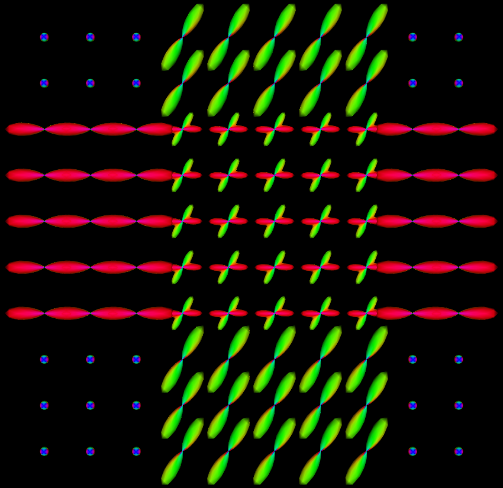
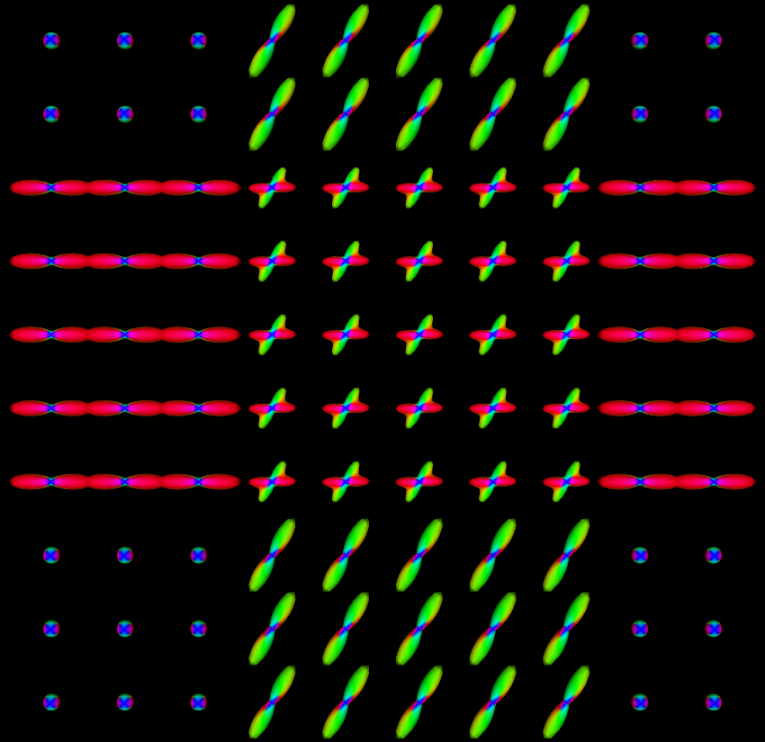

====================
DWI data simulation
====================

Generate DWI data from a configuration file
===========================================

.. _DWISimulator:

   

We provides ``DWISimulator`` routine to generate DWI data from a customizable configuration file.  
See example codes in ``Example/test.sh`` and example configuration files in ``Example`` folder. 

See :ref:`userguide <DWIConfigurationFile>`.

Generate data with 3 shells.

.. code-block:: shell

  mkdir ${DMRITOOL_SOURCE_DIR}/Examples/temp
  cd ${DMRITOOL_SOURCE_DIR}/Examples/temp

  b=1000,2000,3000
  DWISimulator ../dwi_crossing.txt --outdwi dwi.nii.gz --outodf odfTrue.nii.gz --outeap eapTrue_r0.015.nii.gz --qorientations ../Elec060.txt --bvalues ${b} --rorientations ../directions_t4.txt --rvalues 0.015 --noisesigma 0.0 --outb0 dwi_diagonal_b0.nii.gz --outputdwitype EACHSHELL
  
* It uses the same gradient file ``../Elec060.txt`` for these three shells. 
* If you want to use different gradient files in different shell, try to use ``--bfile`` to specifically set b values for each gradient direction. 
* The routine will output a ``dwi.txt`` file (same name as ``dwi.nii.gz``). 
  The file contains three shells separately in three lines, because we set ``--outputdwitype EACHSHELL``. 
  ``--outputdwitype 4DALL`` will generate one dwi data file, one gradient file and one b value file for all 180 DWI volumes.

The ground truth of EAP profile field with radius :math:`15 \mu m` is in ``eapTrue_r0.015.nii.gz``, and 
the ground truth ODF file is ``odfTrue.nii.gz``. 
The you can visualize the ground truth of EAP profiles and ODFs via ``vtkviewer`` or via Paraview_.

.. code-block:: shell

  MeshFromSphericalFunctionTessellatedSamples eapTrue_r0.015.nii.gz eapTrue_r0.015_vis.vtk ../directions_t4.txt  --scale 1e-5
  vtkviewer eapTrue_r0.015_vis.vtk &  
  
  MeshFromSphericalFunctionTessellatedSamples odfTrue.nii.gz odfTrue_vis.vtk ../directions_t4.txt  --scale 1.5
  vtkviewer odfTrue_vis.vtk &

=====================   ================
 |eapTrue_r0.015|         |odfTrue|     
eapTrue_r0.015.nii.gz    odfTrue.nii.gz 
=====================   ================

To obtain the ground truth of MSD map, RTO map, you can use:

.. code-block:: shell

  b=1000,2000,3000
  DWISimulator ../dwi_crossing.txt --outdwi dwi.nii.gz --outodf odfTrue.nii.gz --outeap eapTrue_r0.015.nii.gz --outrto rtoTrue.nii.gz --outmsd msdTrue.nii.gz --qorientations ../Elec060.txt --bvalues ${b} --rorientations ../directions_t4.txt --rvalues 0.015 --noisesigma 0.0 --outb0 dwi_diagonal_b0.nii.gz --outputdwitype EACHSHELL

You can also add noise to the noise-free dwi data.

.. code-block:: shell

  DWINoiseGenerator dwi_b1000.nii.gz  dwi_b1000_noise.nii.gz --snr 25

``--snr 25`` means variance of the noise is ``S(0)/25``, if b0 image is not set by ``--b0``, then ``S(0)=1`` is the default value. 

.. include:: links.inc
