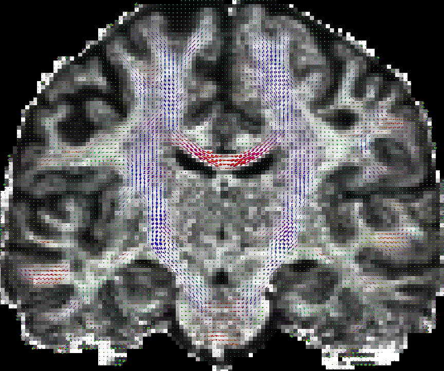
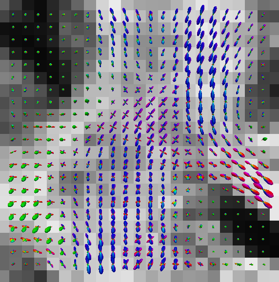
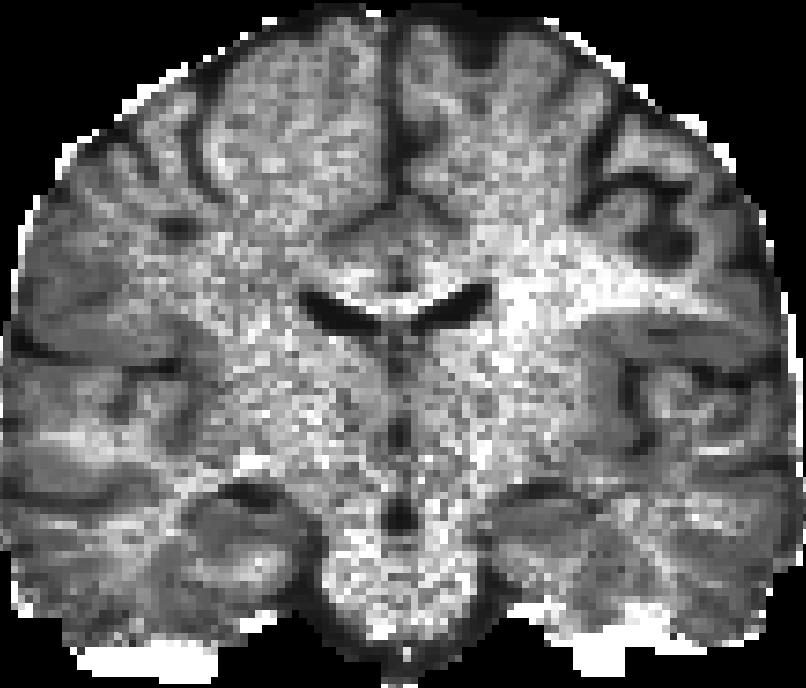
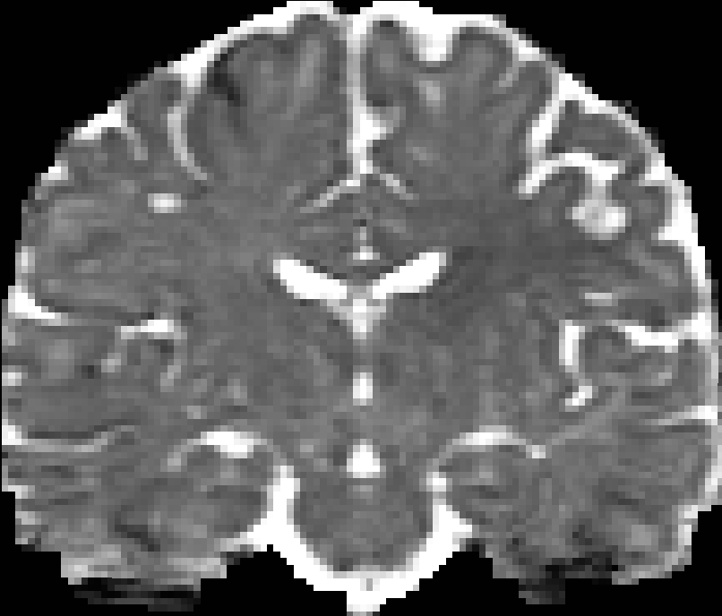
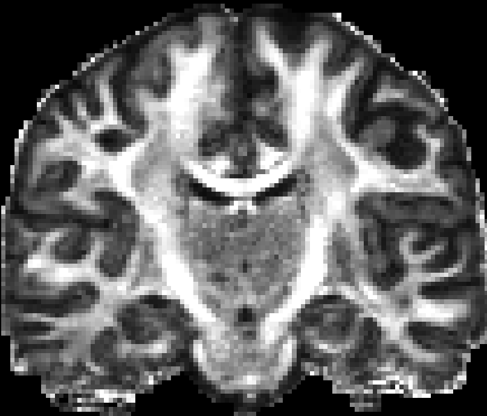

================================
Spherical Polar Fourier Imaging
================================

.. contents:: Table of Contents
   :depth: 2
   :local:

Theory
======

Spherical Polar Fourier Imaging (SPFI) is a reconstruction method to estimate continuous diffusion signal, 
Ensemble Average Propagator (EAP), diffusion Orientation Distribution Function (dODF), 
some meaningful quantities (RTO, MSD, PFA) from samples of DWI signals. 

SPFI represents the signal using 3D SPF basis [Assemlal2009]_: 

.. math::

  
  E(q\uu|\zeta) = \sum_{n=0}^N\sum_{l=0}^L\sum_{m=-l}^l a_{nlm} G_n(q|\zeta) Y_l^m(\uu)

  G_n(q|\zeta)=\left[ \frac{2n!}{\zeta ^{3/2}\Gamma(n+3/2)}\right ]^{1/2}\exp\left(-\frac{q^2}{2\zeta}\right) L_n^{1/2}(\frac{q^2}{\zeta})

where :math:`\q=q\uu, \uu\in \mathbb{S}^2`, :math:`\zeta` is the scale parameter and :math:`Y_l^m(\uu)` is the real spherical harmonic basis.  
   
The reconstruction in SPFI has two steps:

#. Estimate the coefficients of SPF basis from measurements of diffusion signals using compressed sensing, dictionary learning, etc. 
#. Analytically reconstruct EAP, dODF, scalar maps from the SPF coefficients  [Cheng2010a]_  [Cheng2010b]_. 

 
SPFI can be seen as a generalization of Q-Ball Imaging [Tuch2004]_. Compared to QBI which works only for single shell data, SPFI works for arbitrarily sampled data. 
Compared to Diffusion spectrum imaging (DSI), SPFI requires relatively less number of samples and lower b values. 
SPFI uses analytical transforms, avoiding numerical Fourier transform and numerical integral in DSI. 

A typical sampling scheme for SPFI has 2 or 3 b-values, maximal b value more than 3000 s/mm^2, and each shell has more than 30 samples. 
For example, b values are 1500 and 3000, 40 samples per shell. 
The samples in different shell are better to be staggered.  
See :ref:`the tutorial on uniform sampling scheme <uniformsampling>`.
 

Synthetic data Experiment
=========================

DWI data generation
-------------------

Generate DWI data in 3 shells. 
See :ref:`the tutorial on DWI data simulation <DWISimulator>`.

.. code-block:: shell

  mkdir ${DMRITOOL_SOURCE_DIR}/Examples/temp
  cd ${DMRITOOL_SOURCE_DIR}/Examples/temp

  b=1000,2000,3000
  DWISimulator ../dwi_crossing.txt --outdwi dwi.nii.gz --outodf odfTrue.nii.gz --outeap eapTrue_r0.015.nii.gz --qorientations ../Elec060.txt --bvalues ${b} --rorientations ../directions_t4.txt --rvalues 0.015 --noisesigma 0.0 --outb0 dwi_diagonal_b0.nii.gz --outputdwitype EACHSHELL

DL-SPFI reconstruction
----------------------

.. _DL_SPFI:

Reconstruction of SPF coefficients using DL-SPFI (with the default scale).

.. code-block:: shell

  SphericalPolarFourierImaging dwi.txt --sh 8 --ra 4 --signal signalSPF.nii.gz --radius 0.015 --estimation L1_DL --lambdaL1 1e-7

* The above commend is to perform DL-SPFI using SH rank 8 and radial rank 4, regularization parameter lambda 1e-7. 
* It uses default scale :math:`\zeta = 1.0 / (8 \pi^2 \tau D_0)`, default mean diffusivity :math:`D_0=0.7\times 10^{-3}` for all voxels. You can set default mean diffusivity in ``--md0``
* You can try different regularization ``lamdaL1`` around :math:`1e-6` in range :math:`[1e-5, 1e-8]`
* For real data or general synthetic data with unknown mean diffusivity, 
  It is better to estimate mean diffusivity and adaptively set scale for each voxel. 

We use a **generalized high order tensor (GHOT)** model to estimate the mean diffusivity [ChengThesis2012]_. 
Then use DL-SPFI with adaptive scale for adaptive dictionary [Cheng2013]_. 

.. code-block:: shell

  MeanDiffusivityEstimator dwi.txt D_sh4_ra1.nii.gz --sh 4 --ra 1
  SphericalPolarFourierImaging dwi.txt --sh 8 --ra 4 --signal signalSPF.nii.gz --radius 0.015 --estimation L1_DL --lambdaL1 1e-7  --mdImage D_sh4_ra1.nii.gz

.. Note:: You **cannot** use different ranks from SH rank 8 and radial rank 4 for **DL-SPFI**, because the used dictionary was learned using rank ``(8,4)``. 

L1-SPFI reconstruction
----------------------

Without using learned dictionary, you can try L1-SPFI which uses least squares with L1 norm regularization based on compressed sensing [Cheng2011]_.

.. code-block:: shell
  
  SphericalPolarFourierImaging dwi.txt --sh 8 --ra 4 --lambdaSH 1e-9 --lambdaRA 1e-9 --signal signalSPF.nii.gz --radius 0.015 --estimation L1_2 --mdImage D_sh4_ra1.nii.gz

* Without ``--mdImage D_sh4_ra1.nii.gz``, it uses default scale for all voxels.  
* You can try different ranks, and different regularizations ``lambdaSH`` and ``lambdaRA`` around :math:`1e-8`.

L2-SPFI reconstruction
----------------------

Besides DL-SPFI and L1-SPFI, you can also try L2-SPFI which uses least squares with L2 norm regularization [Cheng2010a]_.

.. code-block:: shell
  
  SphericalPolarFourierImaging dwi.txt --sh 6 --ra 2 --lambdaSH 1e-9 --lambdaRA 1e-9 --signal signalSPF.nii.gz --radius 0.015 --estimation LS --mdImage D_sh4_ra1.nii.gz

* Without ``--mdImage D_sh4_ra1.nii.gz``, it uses the default scale for all voxels based on the default mean diffusivity.  
* You can try different ranks, and different regularizations ``lambdaSH`` and ``lambdaRA`` around :math:`1e-8`.
* You may need to use lower ranks in L2-SPFI than L1-SPFI and DL-SPFI. 

.. Note:: We encourage you to use DL-SPFI with adaptive scales other than L2-SPFI or L1-SPFI. 

Analytical reconstruction of EAP and ODF
----------------------------------------

SPFI has analytical relationship between SPF coefficients and EAP profiles, ODFs. 
See [Cheng2010a]_ and [Cheng2010b]_.
You can use different methods (L2-SPFI, L1-SPFI or DL-SPFI) to reconstruct SPF coefficients, 
then you always can efficiently obtain the EAP profiles and ODFs from the SPF coefficients. 
But please set the scale in SPF basis correctly based the mean diffusivity used in SPF coefficients reconstruction, also set the ranks correctly. 

* Analytically obtain EAP profiles and ODFs (using default scale based on default mean diffusivity). 

.. code-block:: shell

    SPFToProfileConverter signalSPF.nii.gz eap_r0.015.nii.gz --sh 8 --ra 4 --radius 0.015 --fourier
    SPFToODFConverter signalSPF.nii.gz odf.nii.gz --sh 8 --ra 4

* Analytically obtain EAP profiles and ODFs (using adaptive scale based on adaptive mean diffusivity). 

.. code-block:: shell

    SPFToProfileConverter signalSPF.nii.gz eap_r0.015.nii.gz --sh 8 --ra 4 --radius 0.015 --fourier --mdImage D_sh4_ra1.nii.gz
    SPFToODFConverter signalSPF.nii.gz odf.nii.gz --sh 8 --ra 4 --mdImage D_sh4_ra1.nii.gz

* Visualization of EAP profiles and ODFs. 

.. code-block:: shell
  
    MeshFromSHCoefficientsConverter eap_r0.015.nii.gz eap_r0.015_vis.vtk --tessorder 4 --scale 1e-5
    vtkviewer eap_r0.015_vis.vtk &
    MeshFromSHCoefficientsConverter odf.nii.gz odf_vis.vtk --tessorder 4 --scale 1.5
    vtkviewer odf_vis.vtk &

Analytical reconstruction of scalar maps
----------------------------------------

We can analytically generate some scalar maps using the estimated SPF coefficients. 
See [Wu2007]_, [Cheng2010a]_, [ChengThesis2012]_.  

* **Return-To-Origin probability (RTO)** is the EAP with :math:`r=0`, i.e. :math:`P(0)`. 
  
.. code-block:: shell

    SPFToScalarMapConverter signalSPF.nii.gz rto.nii.gz --mapType RTO  --sh 8 --ra 4 --mdImage D_sh4_ra1.nii.gz

* **Mean Squared Displacement (MSD)** is the variance of the probability, i.e. :math:`\int_{\mathbb{R}^3} P(R) R^TR d R`.   

.. code-block:: shell
    
    SPFToScalarMapConverter signalSPF.nii.gz msd.nii.gz --mapType MSD  --sh 8 --ra 4 --mdImage D_sh4_ra1.nii.gz

* **Propagator Fractional Anisotropy (PFA)** is a generalization of FA for non-Gaussian EAP. 
  It is defined as the normalized L2 distance between the EAP to its nearest EAP. See [ChengThesis2012]_. 
    
.. code-block:: shell

    SPFToScalarMapConverter signalSPF.nii.gz pfa.nii.gz --mapType PFA  --sh 8 --ra 4 --mdImage D_sh4_ra1.nii.gz

* From the above estimated EAP profiles and ODFs, you can also generate **generalized FA (GFA)**. See [Tuch2004]_. 

.. code-block:: shell

    SHCoefficientsToGFA eap_r0.015.nii.gz eap_r0.015_gfa.nii.gz
    SHCoefficientsToGFA odf.nii.gz odf_gfa.nii.gz

Real data Experiment for Human Connectome Project
=================================================

HCP data 
--------

We downloaded a preprocessed subject data (ID: 100307) from `HCP data <http://www.humanconnectome.org/documentation/Q3/>`__. 
The data has three shells with b values of 1000, 2000, 3000 s/mm^2, 90 samples per shell. 
It also contains 18 volumes with ``b=0``, thus totally it has 288 volumes. 
Considering the data size is big ``(145, 174, 145, 288)``, we cropped only one slice for this tutorial. 
You can download it from `this link <https://www.dropbox.com/s/ct8hsbn8wfp1diw/HCP_100307_c88.zip?dl=0>`__.

Preprocess for DMRITOOL 
-----------------------

The data has already preprocessed. 
Here we just use ``DWIPreprocess`` to normalize the DWI data using the baseline image.  

.. code-block:: shell

  echo b_raw.txt grad_raw.txt dwi_c88.nii.gz > data_c88_raw.txt
  DWIPreprocess data_c88_raw.txt  data_c88_normalize.txt --oEachShell --bThreshold 15 --mask mask_c88.nii.gz  --odwi dwi_c88_normalize.nii.gz  --ograd grad_normalize.txt --ob0Image dwi_c88_b0.nii.gz 

* The b values in the HCP data all larger than 0. There is no exact ``b=0``. Thus we consider b values smaller than the ``bThreshold`` as ``b=0``. 
* The b values are not exactly equal 1000, 2000, or 3000. ``DWIPreprocess`` can group b values and replace b values using the mean of the group. 
* It outputs ``data_c88_normalize.txt`` which contains the b values, gradients and the normalized DWI data.  

DL-SPFI Reconstruction of SPF coefficients
------------------------------------------

Estimate the mean diffusivity first.

.. code-block:: shell

  MeanDiffusivityEstimator data_c88_normalize.txt D_sh4_ra1.nii.gz --sh 4 --ra 1

Perform DL-SPFI to estimate the SPF coefficients.

.. code-block:: shell

  SphericalPolarFourierImaging data_c88_normalize.txt --estimation L1_DL --sh 8 --ra 4 --lambdaL1 1e-6  --signal signalSPF.nii.gz --solver SPAMS --mask mask_c88.nii.gz --mdImage D_sh4_ra1.nii.gz

Reconstruction of EAPs 
----------------------

Obtain EAP profiles from the SPF coefficients, and obtain GFA of EAP profiles.

.. code-block:: shell

  SPFToProfileConverter signalSPF.nii.gz eap_r0.015.nii.gz  --radius 0.015 --ra 4 --sh 8 --mdImage D_sh4_ra1.nii.gz --fourier
  SHCoefficientsToGFA eap_r0.015.nii.gz eap_r0.015_gfa.nii.gz

Generate a coarse mesh (``--tessorder 3``) for visualization the EAP profiles in a whole slice. 

.. code-block:: shell

  MeshFromSHCoefficientsConverter eap_r0.015.nii.gz eap_r0.015_visall.vtk --tessorder 3 --scale 1e-5 

Generate a fine mesh (``--tessorder 4``) for visualization the EAP profiles in a ROI. 

.. code-block:: shell

  MeshFromSHCoefficientsConverter eap_r0.015.nii.gz eap_r0.015_vis.vtk --tessorder 4 --scale 1e-5 --box 80,100,0,0,70,90

You can use ``vtkviewer`` to visualize the vtk files.

.. code-block:: shell

  vtkviewer eap_r0.015_visall.vtk
  vtkviewer eap_r0.015_vis.vtk

But if you want to put scalar map like GFA map in the back group, you'd better to use paraview_. 
See the following results obtained by paraview_. 

===========================   ==========================
 |HCP_eap_r0.015_whole|         |HCP_eap_r0.015_ROI|     
eap_r0.015_visall.vtk               eap_r0.015_vis.vtk 
===========================   ==========================

  
Reconstruction of scalar maps
-----------------------------

Analytical reconstruction of RTO, MSD and PFA maps.

.. code-block:: shell

  SPFToScalarMapConverter signalSPF.nii.gz rto.nii.gz --mapType RTO  --sh 8 --ra 4 --mdImage D_sh4_ra1.nii.gz
  SPFToScalarMapConverter signalSPF.nii.gz msd.nii.gz --mapType MSD  --sh 8 --ra 4 --mdImage D_sh4_ra1.nii.gz
  SPFToScalarMapConverter signalSPF.nii.gz pfa.nii.gz --mapType PFA  --sh 8 --ra 4 --mdImage D_sh4_ra1.nii.gz

You can use many other tools to visualize the 3D volume. 
Here are pictures for the scalar maps I got by ``fslview`` in FSL_. 

===========================   ==========================      ============
 |HCP_RTO|                       |HCP_MSD|                      |HCP_PFA|
  RTO map                         MSD map                       PFA map
===========================   ==========================      ============

.. [Assemlal2009]  Haz-Edine Assemlal, David Tschumperl\'{e}, Luc Brun, 
   `Efficient and robust computation of {PDF} features from diffusion MR signal <http://dx.doi.org/10.1016/j.media.2009.06.004>`__, Medical Image Analysis, vol 13, p. 715-729, 2009
.. [Tuch2004] David S. Tuch, `Q-Ball Imaging <http://onlinelibrary.wiley.com/doi/10.1002/mrm.20279/full>`__,  Magnetic Resonance in Medicine, vol 52, p. 1358-1372, 2004. 
.. [Wu2007]   Yu-Chien Wu, Andrew L. Alexanderb, `Hybrid diffusion imaging <http://www.ncbi.nlm.nih.gov/pubmed/17481920>`__, NeuroImage, vol 36, p. 617-629, 2007.
.. [Cheng2010a] Jian Cheng, Aurobrata Ghosh, Rachid Deriche, Tianzi Jiang, 
   `Model-free and Analytical EAP Reconstruction via Spherical Polar Fourier Diffusion MRI <https://hal.inria.fr/inria-00496932/document>`__, 
   13th International Conference on Medical Image Computing and Computer Assisted Intervention (MICCAI'10), Beijing, September 20-24, 2010
.. [Cheng2010b] Jian Cheng, Aurobrata Ghosh, Rachid Deriche, Tianzi Jiang, 
   `Model-free, regularized, fast, and robust analytical orientation distribution function estimation <https://hal.archives-ouvertes.fr/docs/00/49/69/29/PDF/ODF_MICCAI2010.pdf>`__, 
   13th International Conference on Medical Image Computing and Computer Assisted Intervention (MICCAI'10), Beijing, September 20-24, 2010
.. [Cheng2011]  Jian Cheng, Sylvain Merlet, Emmanuel Caruyer, Aurobrata Ghosh, Rachid Deriche, Tianzi Jiang, 
   `Compressive Sensing Ensemble Average Propagator Estimation via L1 Spherical Polar Fourier Imaging  <http://hal.cirad.fr/inria-00615434/document>`__, 
   MICCAI Workshop on Computational Diffusion MRI (CDMRI'11), Toronto, Canada, September, 2011
.. [ChengThesis2012] Jian Cheng, Estimation and Processing of Ensemble Average Propagator and Its Features in Diffusion MRI, Universite Nice Sophia Antipolis, 2012 
.. [Cheng2013] Jian Cheng, Tianzi Jiang, Rachid Deriche, Dinggang Shen, Pew-Thian Yap, 
   `Regularized Spherical Polar Fourier Diffusion MRI with Optimal Dictionary Learning <https://hal.archives-ouvertes.fr/file/index/docid/824507/filename/DL_SPFI_MICCAI.pdf>`__, 
   16th International Conference on Medical Image Computing and Computer Assisted Intervention (MICCAI'13), Nagoya, September 22-26, 2013

.. include:: links.inc
